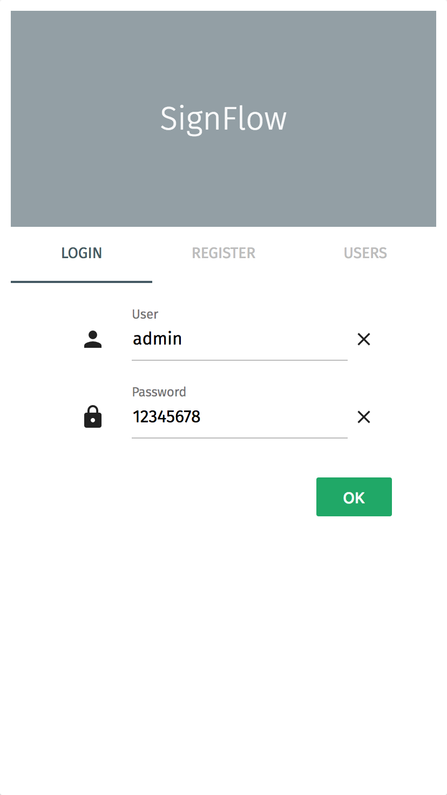

# Signflow

## Maqueta Funcional

### Instalación

#### Requisitos Técnicos
- NodeJS
- GIT

##### Obtención del proyecto

La maqueta consta de dos piezas diferenciadas cada una en su propio repositorio. Sera necesario descargar ambos proyectos mediante GIT:

 - API:

        git clone [repo]/signflow

 - Cliente Web

        git clone [repo]/signflow_api

##### Puesta en marcha

 - API:

        npm install
        npm start

  Arranca un API rest en la direccion http://localhost:5000

 - Cliente Web: npm start

        npm install
        npm start

  Arranca un servidor web en la dirección http://localhost:4444

##### Uso

  El Navegador recomendado es Chrome.
  La direccion local es:

      http://localhost:4444

  En la pantalla de login, bajo la pestaña de USERS podemos encontrar un listado de clientes de la aplicación con distintos roles.

  

    
  

